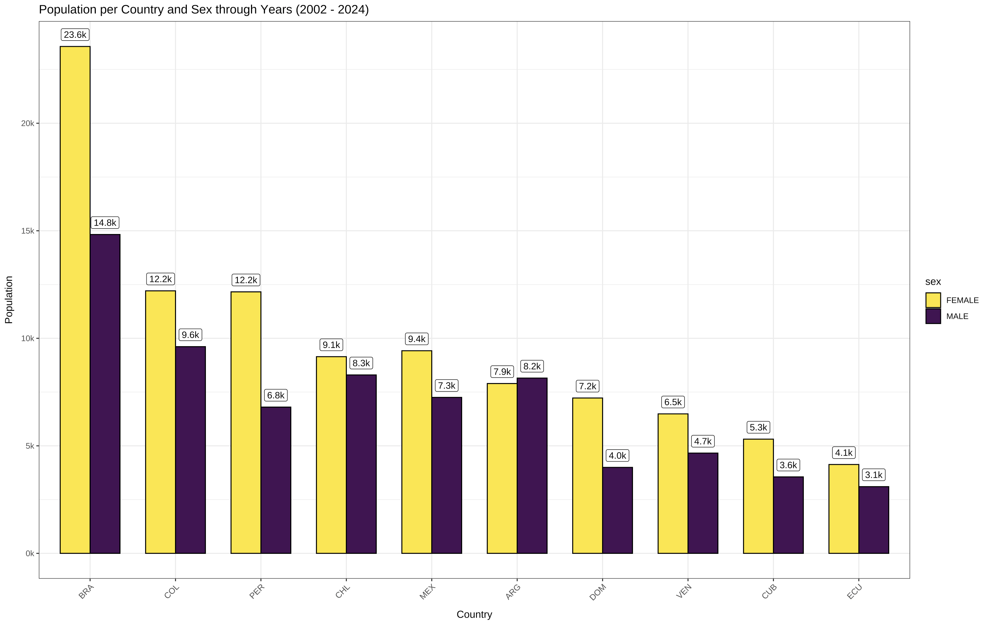
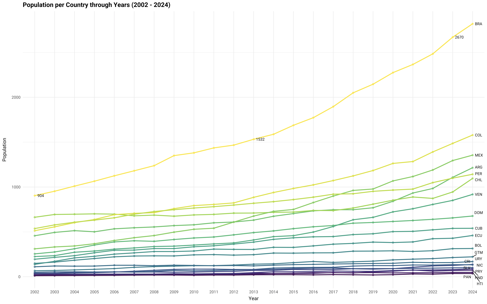
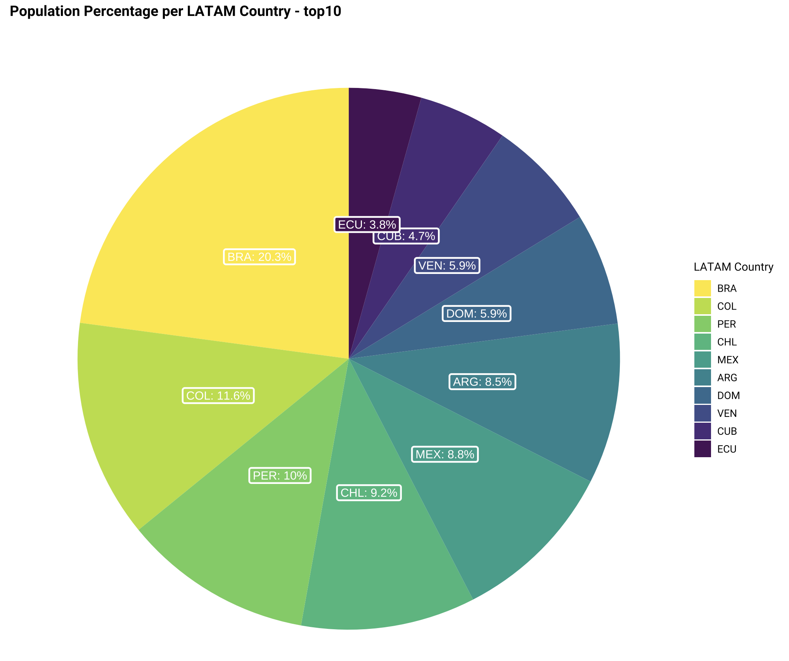

# Viena Latina — Fluxos migratórios da América Latina e Caribe para Viena (2002–2024)

> *Migration flows from Latin America and the Caribbean to Vienna (2002–2024)*

Análise exploratória em R sobre a presença de comunidades latino-americanas registradas em Viena nas últimas duas décadas, desenvolvida para a campanha **"Conhecimentos sobre migração"** do projeto [Viena Latina](https://www.instagram.com/vienalatina), em parceria com a Akademie der bildenden Künste Wien, o Österreichisches Lateinamerika-Institut e o Wien Museum, com apoio da União Europeia.

📄 **[Ver apresentação completa (PDF)](latam_community_vienna_presentation.pdf)** — infográficos em espanhol, português e alemão.

---

## Sobre o projeto

A pergunta que guiou a análise: **quais são as tendências e transformações da migração da América Latina e do Caribe para Viena nos últimos 20 anos?**

Os dados usados são públicos e oficiais, disponibilizados pela *Magistrat Wien — Magistratsabteilung 23 (Wirtschaft, Arbeit und Statistik)*, o departamento de estatística da cidade de Viena, como parte do portal de dados abertos da cidade ([Open Government Data Wien](https://www.data.gv.at/)).

Importante: os números representam **estoque populacional registrado** (pessoas com residência principal em Viena em um determinado ano), e não fluxo migratório — ou seja, não captam entradas e saídas, apenas o total acumulado de residentes naquele momento.

## Principais achados

- O **Brasil** lidera com folga entre as comunidades latino-americanas em Viena, representando **20,3%** do total registrado entre os 10 principais países, com **2.670 pessoas** em 2023 — mais que o dobro da segunda colocada.
- **Colômbia** (11,6%), **Peru** (10%), **Chile** (9,2%) e **México** (8,8%) completam o top 5.
- A população brasileira mais que **triplicou** entre 2002 (904 pessoas) e 2024 (~2.900+), com crescimento mais acentuado a partir de 2014.
- Em quase todos os países analisados, a população **feminina é maior** que a masculina — com exceção da Argentina, onde os números são próximos.

## Visualizações

| | |
|---|---|
|  |  |
| População por país e sexo (2002–2024) | Evolução da população por país (2002–2024) |


*Distribuição percentual entre os 10 principais países de origem*

## Estrutura do repositório

```
viena-latina/
├── bevolkerung_geburtsland.R          # script principal de tratamento e visualização
├── pop_country_birth_since_2002.Rproj # projeto RStudio
├── data/
│   ├── bevolkerung_geburtslandOGD_raw.csv  # dado bruto, fonte: MA23 / Stadt Wien
│   └── df_latam.csv                        # dado tratado, filtrado para países da LATAM
├── plots/
│   ├── bar_graph_men_women_country.png
│   ├── line_graph_pop_country_year.png
│   └── pie_chart_total_country.png
└── docs/
    └── latam_community_vienna_presentation.pdf  # apresentação final (ES/PT/DE)
```

## Metodologia

1. **Fonte de dados**: registro populacional por sexo e país de nascimento, Cidade de Viena, desde 2002 (dataset público da MA23).
2. **Tratamento** (`dplyr`/`tidyr`): remoção de colunas administrativas irrelevantes, renomeação de variáveis, conversão de tipos e filtragem dos 20 códigos de país ISO Alpha-3 correspondentes à América Latina e Caribe.
3. **Agregações**: total por país, total por país e sexo, total por país e ano, e percentual dos 10 países com maior população.
4. **Visualização** (`ggplot2` + `viridis`): gráfico de barras agrupadas, gráfico de linhas com rótulos via `ggrepel`, e gráfico de pizza, com tipografia customizada (Roboto via `showtext`).

## Stack

`R` · `tidyverse` (`dplyr`, `tidyr`, `readr`) · `ggplot2` · `ggrepel` · `scales` · `showtext` · `plotly`

## Como reproduzir

```r
# Abra pop_country_birth_since_2002.Rproj no RStudio, depois:
install.packages(c("tidyverse", "ggrepel", "showtext", "plotly", "scales"))
source("bevolkerung_geburtsland.R")
```

## Créditos

Projeto desenvolvido por **Hugo** para a Viena Latina, no âmbito da campanha de comunicação "Conhecimentos sobre migração" / *"Conocimientos sobre migración"* / *"Wissen über Migration"*.

Dados: Magistrat Wien – MA23, [wien.gv.at](https://www.wien.gv.at/kontakte/ma23/index.html)

---

*Disclaimer (conforme publicação original): dados estatísticos complementam, mas não substituem, outras formas de compreender a complexidade dos processos migratórios; números deixam de fora dinâmicas invisíveis e experiências pessoais que não podem ser quantificadas.*
